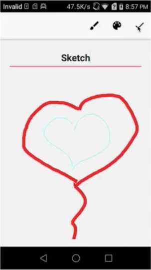

# note-taking-Android-app

This Android app names "littleN". In the demo video, the app’s reaction is a little slow as I share mobile screen to mac via AirDroid. [See demo](https://youtu.be/Rdhleff6u9w)

Developed an mobile app that allows users to write notes, take/choose photos, and draw colorful
pictures.

Integrated SQLite database to enable users to create, read, update and delete notes.

Implemented more features like locking notes with password, searching notes by title, and sharing
notes to other apps.

