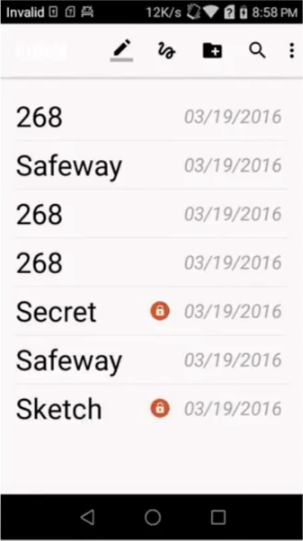
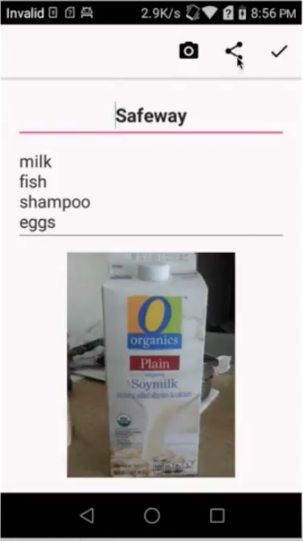

# note-taking-Android-app

This Android app names "littleN". In the demo video, the app’s reaction is a little slow as I share mobile screen to mac via AirDroid. [See demo](https://youtu.be/Rdhleff6u9w)

– Developed an Android app to allow users to write notes, take/choose photos, and draw colorful pictures.

– Created a SQLite connection to enable users to create, read, update, and delete notes.

– Implemented advanced features of locking/unlocking notes with password, searching notes by title, and sharing notes via other apps.

